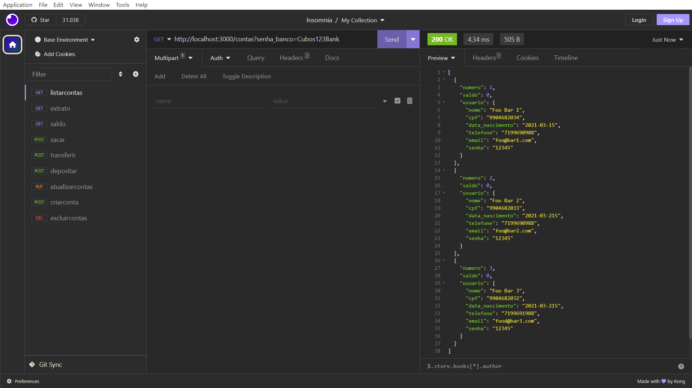
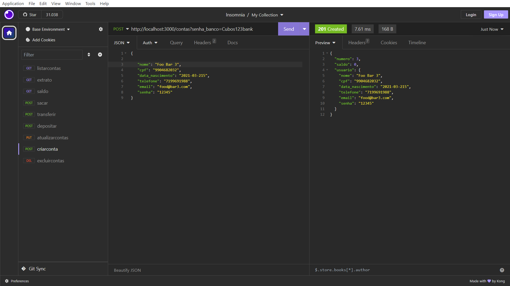
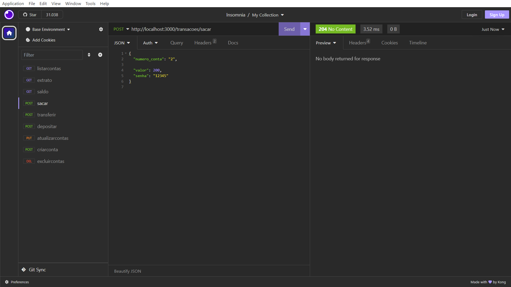
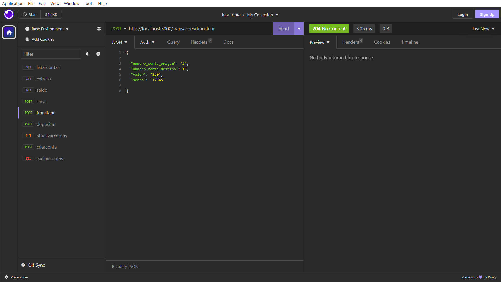
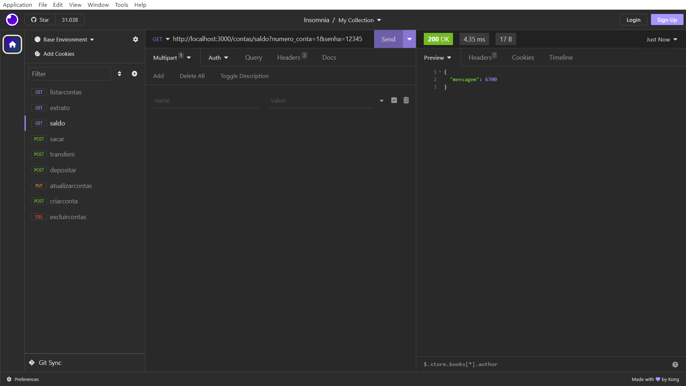
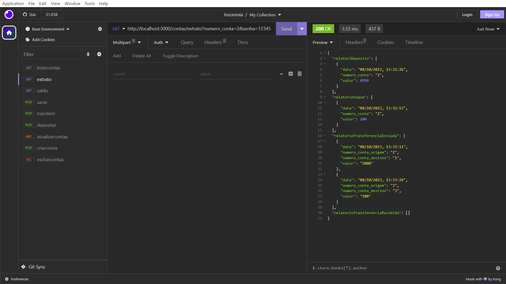

# sistema_bancario


🏦API REST Sistema bancário <br><br>
Este projeto foi desenvolvido para o desafio do Módulo 2 do Curso Desenvolvimento de Software com foco em BackEnd pela Cubos Academy.<br><br>

##  Funcionalidades do Projeto:

- Criar Conta Bancária: Crie facilmente uma nova conta bancária.

- Listar Contas Bancárias: Consulte uma lista completa de todas as contas bancárias cadastradas.

- Atualizar Dados do Usuário: Atualize informações do titular da conta, como nome, data de nascimento e telefone.

- Excluir Conta Bancária: Encerre uma conta bancária existente.

- Depositar: Faça depósitos em sua conta bancária para aumentar o saldo.

- Sacar: Realize saques de sua conta para retirar dinheiro.

- Transferir Valores: Transfira fundos entre diferentes contas bancárias.

- Consultar Saldo: Verifique o saldo atual de sua conta.

- Emitir Extrato Bancário: Obtenha um extrato detalhado das transações em sua conta.

## :man_mechanic: Linguagens e Ferramentas


## 💁‍♂️ Endpoints e exemplos de uso da API utilizando o insomnia

📌Listar contas bancárias<br>
GET /contas?senha_banco=Cubos123Bank<br>
Este endpoint tem a finalidade de listar todas as contas bancárias existentes.<br>
É obrigatório verificar se a senha do banco foi informada como parâmetro de consulta na URL e validar se a senha do banco está correta.<br>
A requisição deve incluir o seguinte parâmetro de consulta: "senha_banco".<br>
A resposta esperada é uma listagem de todas as contas bancárias existentes.<br>


📌Criar conta bancária<br>
POST /contas<br>
Este endpoint cria uma nova conta bancária, gerando um número exclusivo para identificação.<br>
As verificações incluem campos únicos para CPF e e-mail, garantindo que todos os campos obrigatórios estejam preenchidos e definindo um saldo inicial de 0.<br>


📌Excluir Conta<br>
DELETE /contas/:numeroConta<br>
Esse endpoint deve excluir uma conta banária existente.<br>
ele só permite exluir se o saldo da coonta for zero.<br>
Você deve passar o número da conta como paramtero URL e ele verifica se é válido.<br>


📌Depositar<br>
POST /transacoes/depositar<br>
Esse endpoint deverá somar o valor do depósito ao saldo de uma conta válida e registrar essa transação.<br>
Ele vai verificar se o numero da conta e o valor do depósito foi informado no body. Verifica se a conta existe e não permite valores de depósito zerados.<br>
Vai somar o valor dos depósitos no saldo da conta.<br>


📌Sacar<br>
POST /transacoes/sacar<br>
Este endpoint permite realizar saques em contas bancárias.<br>
É necessário fornecer o número da conta, valor do saque e senha. Ele verifica se a conta existe, se a senha é válida, se há saldo disponível e registra a transação.<br>



📌Tranferir<br>
POST /transacoes/transferir<br>
Este endpoint permite transferir recursos entre contas bancárias. É necessário fornecer número da conta de origem, número da conta de destino, senha da conta de origem e valor da transferência.
Ele verifica se ambas as contas existem,se a senha é válida, se há saldo disponível na conta de origem e registra a transação.<br>



📌Saldo<br>
GET /contas/saldo?numero_conta=123&senha=123<br>
Este endpoint retorna o saldo de uma conta bancária.<br>
Você deve fornecer o número da conta e a senha como query params na URL.<br>
O endpoint verifica se a conta existe, se a senha é válida e exibe o saldo da conta em questão como resposta.<br>



📌Extrato<br>
GET /contas/extrato?numero_conta=123&senha=123<br>
Este endpoint lista as transações realizadas em uma conta específica.<br>
Você deve fornecer o número da conta e a senha como query params na URL.<br>
O endpoint verifica se a conta existe, se a senha é válida e retorna um relatório com as transferências, depósitos e saques realizados na conta em questão.<br>



<br>
💻 Rodando o projeto :

```shell
# 1. Clone o projeto

git clone <urlProjeto>

# 2. Instale as dependências

npm install

# 3. Execute 

npm run dev

```
<br>
 🚩 Contribua com o projeto:

- Realize o fork
- Faça as modificações
- Realize o Pull Request(PR)
<br>
✒️ Autora<br><br>
- Paula Borges
